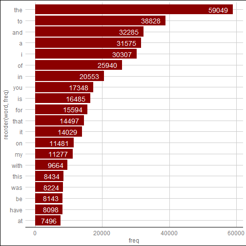
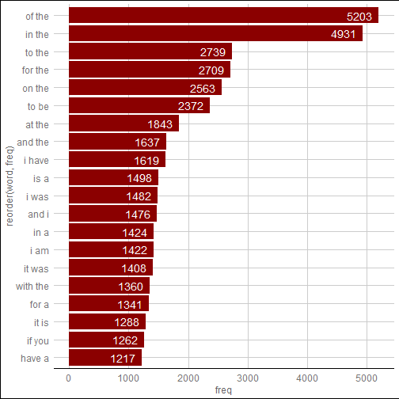
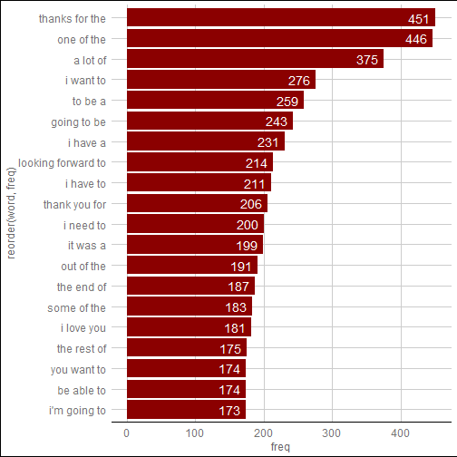

```r
title: "Coursera Data Science Capstone Milestone Report"
```

```
## Warning: NAs introduced by coercion
```

```
## Error in title:"Coursera Data Science Capstone Milestone Report": NA/NaN argument
```

```r
author: "Yibo Fan"
```

```
## Error in eval(expr, envir, enclos): object 'author' not found
```

```r
date: "2019-01-07"
```

```
## Warning: NAs introduced by coercion
```

```
## Error in date:"2019-01-07": NA/NaN argument
```

```r
output: html_document
```

```
## Error in eval(expr, envir, enclos): object 'output' not found
```

```r
# Introduction
This is the milestone report for **Johns Hopkins Data Science Specialization Capstone Project**. The purpose of this milestone report is to show an understanding about the project and current progress. 

## 1.Load Data and packages
```

```
## Error: <text>:2:6: unexpected symbol
## 1: # Introduction
## 2: This is
##         ^
```

```r
library(ggplot2)
library(tm)
library(ggthemes)
library(quanteda)
library(stringi)
library(dplyr)
library(RColorBrewer)
setwd("D:\\R\\Rfile\\Capstone\\final\\en_US")

# Read the file from the working directory
blogs <- readLines("en_US.blogs.txt", encoding = "UTF-8", skipNul = TRUE)
news <- readLines("en_US.news.txt", encoding = "UTF-8", skipNul = TRUE)
twitter <- readLines("en_US.twitter.txt", encoding = "UTF-8", skipNul = TRUE) 
```

## 2 Summary the basic information of the given data set

```r
blogs_length <- length(blogs)
news_length <- length(news)
twitter_length <- length(twitter)
blogs_wordNumber <- stri_count_words(blogs)
news_wordNumber <- stri_count_words(news)
twitter_wordNumber <- stri_count_words(twitter)
blogs_size_MB <- file.size("en_US.blogs.txt")/10^6
news_size_MB <- file.size("en_US.news.txt")/10^6
twitter_size_MB <- file.size("en_US.twitter.txt")/10^6
summary_table <- data.frame(file = c("blogs","news","twitter"),
                            file_size_MB = c(blogs_size_MB,news_size_MB,twitter_size_MB),
                            line_number = c(blogs_length,news_length,twitter_length),
                            word_number = c(sum(blogs_wordNumber,news_wordNumber,twitter_wordNumber)))
rm(blogs_length,news_length,twitter_length,blogs_wordNumber,
   news_wordNumber,twitter_wordNumber,blogs_size_MB,news_size_MB,twitter_size_MB)
summary_table
```

```
##      file file_size_MB line_number word_number
## 1   blogs           NA      899288    70314188
## 2    news           NA       77259    70314188
## 3 twitter           NA     2360148    70314188
```

## 3 Data sampling

```r
set.seed(2019)
dataSample <- c(sample(blogs, length(blogs)*0.02, replace = FALSE),
                sample(news, length(news)*0.02, replace = FALSE) ,
                sample(twitter, length(twitter)*0.02,replace = FALSE))
rm(blogs,news,twitter)
length(dataSample)
```

```
## [1] 66732
```

```r
#save(dataSample,file="dataSample.RData")
```

## 4.Data Cleaning
##### Do a set of processing for the corpus. By checking getTransformations(), 
##### you can see different transformations and define several functions.

```r
if(!file.exists("./swearWords.txt")){
        download.file(url = "https://www.cs.cmu.edu/~biglou/resources/bad-words.txt",
                      destfile= "./swearWords.txt",
                      method = "curl")
}
profanity <- scan("./swearWords.txt", what = "character", sep = "\n", encoding = "UTF-8")
# make tokens for all n-grams.
tokensAll = dataSample %>% tokens(what="word", remove_numbers = TRUE,
                                  remove_punct = TRUE,
                                  remove_separators = TRUE,
                                  remove_symbols = TRUE,
                                  remove_twitter = TRUE,
                                  verbose = TRUE) %>% tokens_tolower() %>% tokens_remove(profanity)
rm(dataSample) 
# unigram
unigrams <- dfm(tokensAll, ngrams = 1, concatenator = " ", ignoredFeatures = profanity)
# biogram
bigrams <- dfm(tokensAll, ngrams = 2, concatenator = " ", ignoredFeatures = profanity)
# trigram
trigrams <- dfm(tokensAll, ngrams = 3, concatenator = " ", ignoredFeatures = profanity)
```
## 5 Make plotting

```r
# make a function of plot
createPlot <- function(data) {
        ggplot(data, aes(x = reorder(word,freq), y = freq)) + geom_bar(stat="identity", fill='darkred') +coord_flip()+theme_gdocs()+
                geom_text(aes(label=freq), colour="white",hjust=1.25, size=5.0)
}
# slect top 20 frequece words
top20unigrams <- topfeatures(unigrams, 20)
top20bigrams <- topfeatures(bigrams, 20)
top20trigrams <- topfeatures(trigrams, 20)
unigramsDf_20 <- data.frame(word=names(top20unigrams), freq=top20unigrams)
bigramsDf_20 <- data.frame(word=names(top20bigrams), freq=top20bigrams)
trigramsDf_20 <- data.frame(word=names(top20trigrams), freq=top20trigrams)

# make a plot of the selected n-grams and their frequences.
createPlot(unigramsDf_20)
```



```r
createPlot(bigramsDf_20)
```



```r
createPlot(trigramsDf_20)
```



## 6. Way Forward
Here, we did the previous steps of exploring the data sets. In the next steps, I am gonna use the n-grams combined with Backoff strategy to do some predictions based on the previous few words. In order to improve the proficiency, I will do data table which is fast in large data sets.
```
```

